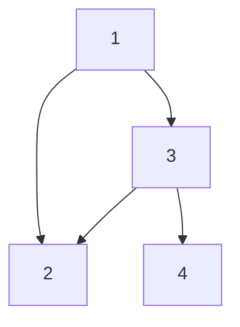

- Tree: N nodes, N-1 edges, fewer edges than nodes, so no cycles;
- Graph: N nodes, M edges, cycles may exist (check for duplicates when searching); a tree is a specialized graph.
- Node: state, Edge: change of state; use this idea to construct a graph.
- inEdge / inDeg: In-degree (incoming edges), in a directed graph, the number of edges pointing to this node; out-degree (outgoing edges), in a directed graph, the number of edges from this node to other nodes.

## Data Structures



### Outgoing edge array (Preferred)

- `vector<vector<int>>`: `vector<int>` is a list of nodes connected to the current node.
- Space complexity: O(n + m), n is the number of nodes, m is the number of edges.

```
1: [2, 3]
2: []
3: [2, 4]
4: []
```

### Adjacency matrix

- Disadvantage: When there are many nodes and few edges (sparse graph), it is very space-consuming. For N nodes, the matrix consumes N^2 space.

```
  1 2 3 4
1 0 1 1 0
2 0 0 0 0
3 0 1 0 1
4 0 0 0 0
```

### Adjacency linked list

- Note: When building a linked list, inserting at the head of a singly linked list has a time complexity of O(1).

```
1 -> 3 -> 2 -> null
2 -> null
3 -> 4 -> 2 -> null
4 -> null
```

### Undirected graph

- Add two edges for each edge. e.g., `a -> b, b -> a`

## Topological Sort

Algorithm finds a topological order in O(m + n) time.

Maintain the following information:

- count(w) = remaining number of incoming edges
- S = set of remaining nodes with no incoming edges
  - Initialization: O(m + n) via single scan through graph.
  - Update: to delete v
- remove v from S
- decrement count(w) for all edges from v to w;
  and add w to S if count(w) hits 0
- this is O(1) per edge

## References

- [Graphs.PDF from cs.princeton.edu](https://www.cs.princeton.edu/~wayne/kleinberg-tardos/pdf/03Graphs.pdf)
