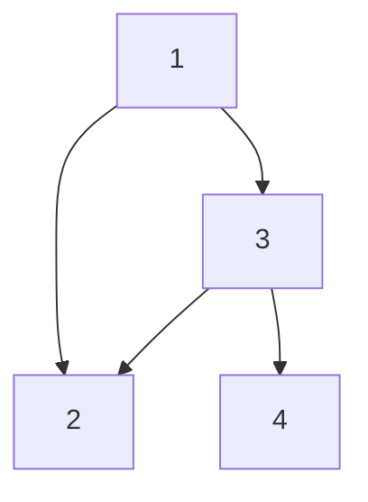

- Tree (Connected Acyclic Graph): N nodes, N-1 edges, fewer edges than nodes, so no cycles;
  - A tree is a specialized graph.
- Graph: N nodes, M edges, cycles may exist
  - Check for visited nodes to avoid infinite loops.
  - No root node.
- **Node: state, Edge: change of state; use this idea to construct a graph.**
- inEdge / inDeg: In-degree (incoming edges), in a directed graph, the number of edges pointing to this node; out-degree (outgoing edges), in a directed graph, the number of edges from this node to other nodes.
- Layer of a node: the shortest path from the root node to the current node.
- **Directed Acyclic Graph** (DAG): A directed graph with no cycles.
  - Task scheduling, topological sort.
  - Mining: finding the longest path in a DAG.

:::tip
Draw a graph makes it easier to understand the problem.
:::

## Data Structures



### Outgoing edge array (Preferred)

- `vector<vector<int>>`: `vector<int>` is a list of nodes connected to the current node.
- Space complexity: O(n + m), n is the number of nodes, m is the number of edges.

```
1: [2, 3]
2: []
3: [2, 4]
4: []
```

### Adjacency matrix

- Disadvantage: When there are many nodes and few edges (sparse graph), it is very space-consuming. For N nodes, the matrix consumes N^2 space.

```
  1 2 3 4
1 0 1 1 0
2 0 0 0 0
3 0 1 0 1
4 0 0 0 0
```

### Adjacency linked list

- Note: When building a linked list, inserting at the head of a singly linked list has a time complexity of O(1).

```
1 -> 3 -> 2 -> null
2 -> null
3 -> 4 -> 2 -> null
4 -> null
```

### Undirected graph

- Add two edges for each edge. e.g., `a -> b, b -> a`

## Topological Sort

- Sort a Directed Acyclic Graph (DAG) such that for every node `v`,
  - all the nodes that `v` points to are to the right of `v`.
  - all the nodes that point to `v` are to the left of `v`.
  - e.g. v -> a, v -> b, c -> v, the topological order can be c -> v -> a -> b, or c -> v -> b -> a.
- Sort result is not unique.
  - Imagine multiple tasks that has no dependency, the order of these tasks can be arbitrary.
- Algorithm finds a topological order in O(m + n) time.

:::warning
If the graph has a cycle, it cannot have a topological order.

The reason is that a cycle means there is a circular dependency between nodes, which makes it impossible to determine which node should come first.

Using the topological sort algorithm can not visit all nodes in the graph, beacause in-degree of some nodes will never be 0 so they will never be added to the queue.
:::

### BFS

- Maintain the following information:
  - count(w) = remaining number of incoming edges
  - S = set of remaining nodes with no incoming edges
- Initialization: O(m + n) via single scan through graph.
- Update: to delete v
  - remove v from S
  - decrement count(w) for all edges from v to w; and add w to S if count(w) hits 0
  - this is O(1) per edge

:::note

:::

### Use Cases

- Find the maximum depth of each node in a graph.
  - Each node will enqueue when its in-degree is 0, and the max depth of a node add 1 to the max depth of its parent node.

## References

- [Graphs.PDF from cs.princeton.edu](https://www.cs.princeton.edu/~wayne/kleinberg-tardos/pdf/03Graphs.pdf)
